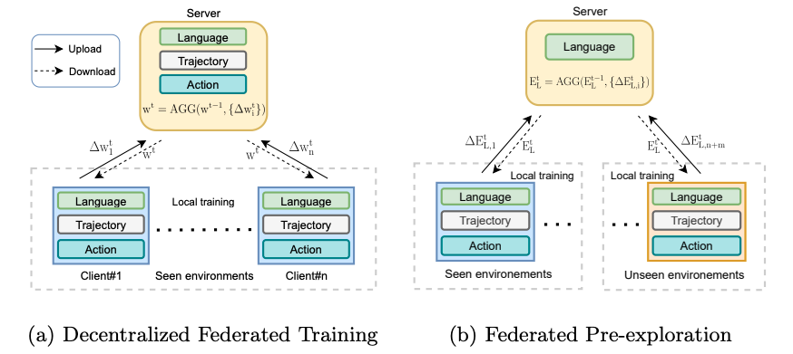

<div align="center">

<h1>FedVLN: Privacy-preserving Federated Vision-and-Language Navigation</h1>

<div>
    <a href='https://kevinz-01.github.io/' target='_blank'>Kaiwen Zhou</a>;
    <a href='https://eric-xw.github.io/' target='_blank'>Xin Eric Wang</a>;
</div>
<div>
    <sup>1</sup>University of California, Santa Cruz, USA&emsp;
</div>

<h3><strong>Accepted to <a href='https://eccv2022.ecva.net/' target='_blank'>ECCV 2022</a></strong></h3>

<h3 align="center">
  <a href="https://arxiv.org/abs/2203.14936" target='_blank'>Paper</a>
</h3>
</div>
<!--## Summary-->
<!--In this paper, we are the first to discuss data privacy concerns for vision-and-language navigation and define the privacy-preserving embodied AI problem for the two learning stages in VLN. We propose a novel federated learning framework for privacy-preserving VLN to ensure that users do not need to share their data to any party. Extensive results on R2R and RxR show that our federated learning framework not only achieves comparable results with centralized training, but also outperforms centralized and environment-based pre-exploration methods.-->

## Abstract

Data privacy is a central problem for embodied agents that can perceive the environment, communicate with humans, and act in the real world. While helping humans complete tasks, the agent may observe and process sensitive information of users, such as house environments, human activities, etc. In this work, we introduce privacypreserving embodied agent learning for the task of Vision-and-Language Navigation (VLN), where an embodied agent navigates house environments by following natural language instructions. We view each house environment as a local client, which shares nothing other than local updates with the cloud server and other clients, and propose a novel Federated Vision-and-Language Navigation (FedVLN) framework to protect data privacy during both training and pre-exploration. Particularly, we propose a decentralized federated training strategy to limit the data of each client to its local model training and a federated preexploration method to do partial model aggregation to improve model generalizability to unseen environments. Extensive results on R2R and RxR datasets show that, decentralized federated training achieves comparable results with centralized training while protecting seen environment privacy, and federated pre-exploration significantly outperforms centralized pre-exploration while preserving unseen environment privacy.

## Architecture


We release the reproducible code here.

## Environment Installation

Python requirements: Need python3.6
```
pip install -r python_requirements.txt
```

Please refer to [this link](https://github.com/peteanderson80/Matterport3DSimulator) to install Matterport3D simulator: 


## Pre-Computed Features
### ImageNet ResNet152

Download image features for environments:
```
mkdir img_features
wget https://www.dropbox.com/s/o57kxh2mn5rkx4o/ResNet-152-imagenet.zip -P img_features/
cd img_features
unzip ResNet-152-imagenet.zip
```

### CLIP Features
Please download the CLIP-ViT features for CLIP-ViL models with this link:
```
wget https://nlp.cs.unc.edu/data/vln_clip/features/CLIP-ViT-B-32-views.tsv -P img_features
```

## Training RxR

### Data
Please download the pre-processed data with link:
```
wget https://nlp.cs.unc.edu/data/vln_clip/RxR.zip -P tasks
unzip tasks/RxR.zip -d tasks/
```

### Training the Fed CLIP-ViL agent
For training Fed CLIP-ViL agent on RxR dataset, please run

```
    name=agent_rxr_en_clip_vit_fedavg_new_glr12
    flag="--attn soft --train listener
      --featdropout 0.3
      --angleFeatSize 128
      --language en
      --maxInput 160
      --features img_features/CLIP-ViT-B-32-views.tsv
      --feature_size 512
      --feedback sample
      --mlWeight 0.4
      --subout max --dropout 0.5 --optim rms --lr 1e-4 --iters 200000 --maxAction 35
      --if_fed True
      --fed_alg fedavg
      --global_lr 12
      --comm_round 910
      --n_parties 60"

    mkdir -p snap/$name
    CUDA_VISIBLE_DEVICES=0 python3 rxr_src/train.py $flag --name $name
```

Or you could simply run the script with the same content as above(we will use this in the following):

```
    bash run/agent_rxr_clip_vit_en_fedavg.bash
```
    
### Training Fed Envdrop agent
```
    bash agent_rxr_resnet152_fedavg.bash
```

## Training R2R

### Download the Data
Download Room-to-Room navigation data:
```
bash ./tasks/R2R/data/download.sh
```

### Train the Fed CLIP-ViL Agent
Run the script:
```
bash run/agent_clip_vit_fedavg.bash
```
It will train the agent and save the snapshot under snap/agent/. Unseen success rate would be around 53%.

### Augmented training
- Train the speaker
  ```
  bash run/speaker_clip_vit_fedavg.bash
  ```
  It will train the speaker and save the snapshot under snap/speaker/

- Augmented training:

  After pre-training the speaker and the agnet,
  ```
  bash run/bt_envdrop_clip_vit_fedavg.bash
  ```
  It will load the pre-trained agent and train on augmented data with environmental dropout.
  
### Training the Fed Envdrop agent
- Agent
  ```shell
  bash run/agent_fedavg.bash
  ```
- Fed Speaker + Aug training
  ```shell
  bash run/speaker_fedavg.bash
  bash run/bt_envdrop_fedavg.bash
  ```

### Fed CLIP-ViL pre-exploration
After train the CLIP-ViL speaker, run
```shell
  bash run/pre_explore_clip_vit_fedavg.bash
```

### Fed Envdrop pre-exploration
After train the resnet speaker, run
```shell
  bash run/pre_explore_fedavg.bash
  ```

## Related Links
- CLIP-ViL: [paper](https://arxiv.org/abs/2107.06383), [code](https://github.com/clip-vil/CLIP-ViL/tree/master/CLIP-ViL-VLN)
- EnvDrop: [paper](https://arxiv.org/abs/1904.04195), [code](https://github.com/airsplay/R2R-EnvDrop)
- R2R Dataset: [paper](https://arxiv.org/pdf/1711.07280.pdf), [code](https://github.com/peteanderson80/Matterport3DSimulator)
- RxR Dataset: [paper](https://arxiv.org/abs/2010.07954), [code](https://github.com/google-research-datasets/RxR)

## Reference
If you use FedVLN in your research or wish to refer to the baseline results published here, 
please use the following BibTeX entry. 


```shell 
@article{zhou2022fedvln,
  title={FedVLN: Privacy-preserving Federated Vision-and-Language Navigation},
  author = {Zhou, Kaiwen and Wang, Xin Eric},
  journal={arXiv preprint arXiv:2203.14936},
  year={2022}
}
```
